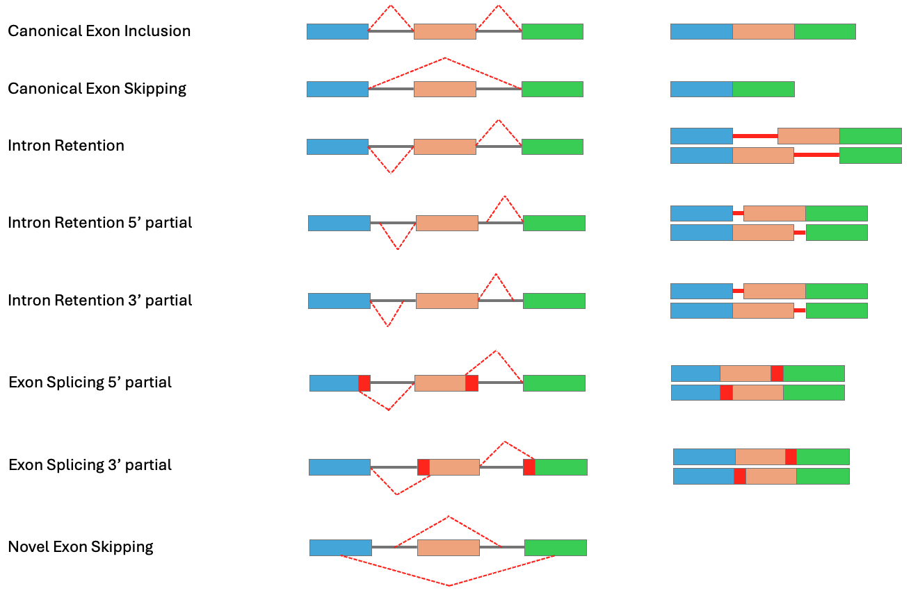

<div align="center">
<h1 align="center">Splicing Analysis Pipeline</h1>
  <p align="center">A nextflow pipeline of identifying and quantifying splicing events</p>
</div>

<p align="center">
  
</p>

## Table of Contents
<details open>
<summary><b>Catalogue</b></summary>

1. [Description](#description)
2. [Dependencies](#dependencies)
3. [File Format](#file-format)
    - [Sample Sheet](#samplesheet)
    - [Reference File](#reference-file)
    - [Barcode File](#barcode-file)
4. [Usage](#usage)
    - [Run](#run)
    - [Options](#options)
5. [Outputs](#outputs)
    - [Structure](#structure)
    - [File Description](#file-description)
6. [Note](#note)
    - [Junction Classification](#junction-classification)
</details>

<!-- Description-->
## Description
This pipeline is designed to quantify splicing events within minigene-based mutagenesis libraries. Minigene systems are widely used to study the regulatory mechanisms of RNA splicing, particularly in the context of variant interpretation and functional genomics. By introducing specific mutations into synthetic constructs (minigenes), researchers can assess how sequence changes affect splicing outcomes in a controlled cellular environment.

<br>

<!-- Dependencies-->
## Dependencies
<details>
<summary><b>Software</b></summary>

    pigz = 2.7
    BWA = 0.7.17
    HISAT2 = 2.2.1
    Samtools = 1.21
    bamtools = 2.5.2
    FLASH2 = 2.2.00
    fastp = 0.23.4
    RegTools = 1.0.0
    python = 3.10
    R = 4.3.1
    nextflow = 23.10.0
</details>

<details>
<summary><b>Python Libraries</b></summary>

    pysam = 0.22.1
    scipy = 1.15.3
    pandas = 2.2.2
    numpy = 2.1.2
    matplotlib = 3.7.3
    biopython = 1.85
    polars = 1.25.2
</details>

<details>
<summary><b>R Packages</b></summary>

    data.table = 1.15.4
    UpSetR = 1.4.0
    gplots = 3.1.3.1
    corrplot = 0.92
    reshape2 = 1.4.4
    optparse = 1.7.4
    psych = 2.4.3
    reactable = 0.4.4
    tidyverse = 2.0.0
    stringr = 1.5.1
    performanceanalytics = 2.0.4
    parallelly = 1.37.1
    dendextend = 1.17.1
    sparkline = 2.0
    ggVennDiagram = 1.5.2
    htmltools = 0.5.8
</details>

<details>
<summary><b>Bioconductor Packages</b></summary>

    GenomicRanges = 1.54.1
    Rsamtools = 2.18.0
    Biostrings = 2.70.3
</details>

<br>

<!-- File Format-->
## File Format

<a id="samplesheet"></a>

### Sample Sheet
| sample | replicate | directory | read1 | read2 | reference | barcode | barcode_up | barcode_down | barcode_temp |
| - | - | - | - | - | - | - | - | - | - |
| s1 | rep1 | /path/of/directory/ | s1_rep1_r1.fastq.gz | s1_rep1_r2.fastq.gz | s1_ref.fa | s1_barcode.txt | GCAGAAAGCACAGAAAGGAA | CTACTGATTCGATGCAAGCTT | NNNNATNNNNATNNNNATNNNNATNNNNATNNNNATNN |
| s1 | rep2 | /path/of/directory/ | s1_rep2_r1.fastq.gz | s1_rep2_r2.fastq.gz | s1_ref.fa | s1_barcode.txt | GCAGAAAGCACAGAAAGGAA | CTACTGATTCGATGCAAGCTT | NNNNATNNNNATNNNNATNNNNATNNNNATNNNNATNN |
| s1 | rep3 | /path/of/directory/ | s1_rep3_r1.fastq.gz | s1_rep3_r2.fastq.gz | s1_ref.fa | s1_barcode.txt | GCAGAAAGCACAGAAAGGAA | CTACTGATTCGATGCAAGCTT | NNNNATNNNNATNNNNATNNNNATNNNNATNNNNATNN |
| s2 | rep1 | /path/of/directory/ | s2_rep1_r1.fastq.gz | s2_rep1_r2.fastq.gz | s2_ref.fa | s2_barcode.txt | GCAGAAAGCACAGAAAGGAA | CTACTGATTCGATGCAAGCTT | NNNNATNNNNATNNNNATNNNNATNNNNATNNNNATNN |
| s2 | rep2 | /path/of/directory/ | s2_rep2_r1.fastq.gz | s2_rep2_r2.fastq.gz | s2_ref.fa | s2_barcode.txt | GCAGAAAGCACAGAAAGGAA | CTACTGATTCGATGCAAGCTT | NNNNATNNNNATNNNNATNNNNATNNNNATNNNNATNN |
| s2 | rep3 | /path/of/directory/ | s2_rep3_r1.fastq.gz | s2_rep3_r2.fastq.gz | s2_ref.fa | s2_barcode.txt | GCAGAAAGCACAGAAAGGAA | CTACTGATTCGATGCAAGCTT | NNNNATNNNNATNNNNATNNNNATNNNNATNNNNATNN |

> [!IMPORTANT]
> 1. The sample sheet must be a **csv** file and the header must be like above in the example
> 2. All the files should be in the **directory** for each sample
> 3. **barcode_up** is the upstream flanking seqeuence of the barcode, **barcode_down** is the downstream
> 4. **barcode_temp** is the template sequence of the barcode

<br>

### Reference File
The reference must be the sequence(s) of the minigene.

* **Random Intron Library:** The reference file should contain all variant sequences. For example, if the library includes 100 random intron sequences, the reference fasta file must include all 100 corresponding sequences.
* **Mutagenesis Library:** The reference file only needs the wild-type sequence.

> [!IMPORTANT]
> 1. File must be a fasta file
> 2. **Exons** must be in **Uppercase**
> 3. **Introns** must be in **Lowercase**

<br>

### Barcode Association File
Please provide the barcode association file as below

| barcode | variant | varid | count |
| - | - | - | - |
| CCAAATAATCATTAGGATCAGCATATTAATCTAGATTC | GTAAGTCGAAGAATTCTTGGGGAAACAGATTGAAATAACTTGGGAAGTAGTTCTTTCTCTTAGTGTGAAAGTATGTTCTCA | var1 | 56 |
| ATCTATCAGAATGTATATTGGGATAAAAATAGTGATTC | GTAAGTGATTCAGGAGAGTTTCGTTCAGATTGAAATAACTTGGGAAGTAGTTCTTTCTCTTAGTGTGAAAGTATGTTCTCA | var2 | 293 |

> [!IMPORTANT]
> 1. The barcode association file must be a **tsv** file and the header must be like above in the example

<br>

<!-- Usage-->
## Usage

<a id="run"></a>

### Run -- Sanger farm
Please submit the bash script below

```bash
#!/bin/bash
#BSUB -o %J.o
#BSUB -e %J.e
#BSUB -R "select[mem>1000] rusage[mem=1000]"
#BSUB -M 1000
#BSUB -q normal
#BSUB -J nf_splicing
   
# modules
module load HGI/common/nextflow/23.10.0
module load HGI/softpack/users/fs18/nf_splicing
   
#--------------#
# user specify #
#--------------#
# LSF group
export LSB_DEFAULT_USERGROUP=hgi
   
# Paths
export INPUTSAMPLE=$PWD/inputs/sample_sheet.csv
export OUTPUTRES=$PWD/outputs
  
#-----------#
# pipelines #
#-----------#
nextflow run -resume nf_splicing/main.nf --sample_sheet $INPUTSAMPLE \
                                         --library      random
```

<a id="options"></a>

### Options
#### Mandatory arguments
    --sample_sheet                path of the sample sheet
    --outdir                      the directory path of output results, default: the current directory
    --do_pe_reads                 whether to process paired-end reads, default: false

#### Optional arguments
    Basic:
    --library                     random, muta, default: muta
    --barcode_template            barcode template, default: NNNNATNNNNATNNNNATNNNNATNNNNATNNNNATNN
    --barcode_marker              barcode marker, default: CTACTGATTCGATGCAAGCTTG

    Fastp:
    --fastp_cut_mean_quality      mean quality for fastp, default: 20
    
    Flash2:
    --flash2_min_overlap          min overlap for flash2, default: 10
    --flash2_max_overlap          max overlap for flash2, default: 250
    --flash2_min_overlap_outie    min overlap outie for flash2, default: 20
    --flash2_max_mismatch_density max mismatch density for flash2, default: 0.25
    
    BWA:
    --bwa_gap_open                gap open penalty for BWA, default: 10,10
    --bwa_gap_ext                 gap extension penalty for BWA, default: 5,5
    --bwa_clip                    clip penalty for BWA, default: 1,1

    Barcode extraction:
    --filter_softclip_base        softclip base for filtering, default: 5
    
    HISAT2:
    --hisat2_score_min            min score for HISAT2, default: L,0,-0.3
    --hisat2_mp                   min/max mismatch penalty for HISAT2, default: 5,2
    --hisat2_sp                   min/max splice penalty for HISAT2, default: 2,1
    --hisat2_np                   non-canonical splicing penalty for HISAT2, default: 0
    --hisat2_pen_noncansplice     non-canonical splicing penalty for HISAT2, default: 0
    
    Spliced products:
    --do_spliced_products         whether to process spliced products, default: false

    Regtools:
    --regtools_min_anchor         min anchor length for regtools, default: 5
    --regtools_min_intron         min intron length for regtools, default: 20

    Junction classification:
    --classify_min_overlap        min overlap for classification, default: 2
    --classify_min_cov            min coverage for classification, default: 2
    --classify_reduce             reduce the number of reads for classification, default: 2


<!-- Outputs-->
## Outputs
### Structure

```bash
📁 output_directory
    ├─── 📁 extracted_barcodes
    │       ├─── 📁 s1_rep1
    │       │       ├─── 📄 canonical_barcodes.txt
    │       │       └─── 📄 novel_barcodes.txt
    │       ├─── 📁 s1_rep2
    │       └─── 📁 s1_rep3
    ├─── 📁 novel_junctions
    │       ├─── 📁 s1_rep1
    │       │       ├─── 📄 junctions.bed
    │       │       ├─── 📄 classified_junctions.txt
    │       │       ├─── 📄 classified_junctions.reduce.txt
    │       │       ├─── 📄 classified_junctions.png
    │       │       └─── 📄 classified_variants.png
    │       ├─── 📁 s1_rep2
    │       └─── 📁 s1_rep3
    ├─── 📁 novel_splicing_results
    │       ├─── 📁 s1_rep1
    │       │       ├─── 📄 spliced_alignment.bam
    │       │       └─── 📄 spliced_products.txt
    │       ├─── 📁 s1_rep2
    │       └─── 📁 s1_rep3
    ├─── 📁 splicing_counts
    │       ├─── 📄 s1_rep1.splicing_matrix.txt
    │       ├─── 📄 s1_rep2.splicing_matrix.txt
    │       └─── 📄 s1_rep3.splicing_matrix.txt
    └─── 📁 splicing_reports
            └─── 📁 s1
                    ├─── 📄 splicing_report.html
                    └─── 📄 *.png
```

### File Description
#### Extracted barcodes
These files summarize all the barcodes in the sequencing library, categorized by canonical and novel splicing events. Compared to the barcode association file, they typically contain more detected barcodes, as the pipeline permits a one-base mismatch during barcode detection.

> [!NOTE]
> 📄 **barcodes of canonical splicing events**
>  
> | name | barcode | varid | count |
> | - | - | - | - |
> | E1_E2_E3 | ATTAATAATTATCTCTATAGGCATGACCATGATCATAG | var1 | 23 |
> | E1_E3 | TTTTATTTCGATATTAATCATGATATAAATGTTCATAC | var2 | 143 |
>
> 📄 **barcodes of novel splicing events**
> 
> | barcode | varid | count |
> | - | - | - |
> | ATTAATAATTATCTCTATAGGCATGACCATGATCATAG | var1 | 23 |
> | TTTTATTTCGATATTAATCATGATATAAATGTTCATAC | var2 | 143 |

<br>

#### Novel junctions

> [!NOTE]
> 📄 **junction bed file**
> 
> This is a bed output file which contains all the junctions detected in the sample.
>
> | chrom | chromStart | chromEnd | name | score | strand | thickStart | thickEnd | itemRgb | blockCount | blockSizes | blockStarts |
> | - | - | - | - | - | - | - | - | - | - | - | - |
> | var1 | 25 | 451 | JUNC00000001 | 55 | ? | 25 | 451 | 255,0,0 | 2 | 35,29 | 0,397 |
> | var1 | 28 | 451 | JUNC00000002 | 156 | ? | 28 | 451 | 255,0,0 | 2 | 73,106 | 0,317 |
> | var2 | 29 | 451 | JUNC00000004 | 225 | ? | 29 | 451 | 255,0,0 | 2 | 37,303 | 0,119 |
> | var3 | 29 | 451 | JUNC00000006 | 84 | ? | 29 | 451 | 255,0,0 | 2 | 33,101 | 0,321 |
> | var3 | 29 | 451 | JUNC00000007 | 43 | ? | 29 | 451 | 255,0,0 | 2 | 29,29 | 0,393 |
>
> 📄 **classified junctions of all the variants**
> 
> This is a tsv output file which contains all the classified junctions for all the variants
> | varid | start | end | cov | annotation |
> | - | - | - | - | - | 
> | var1 | 48 | 139 | 11 | exon_splicing_3p_E1;<br>intron_retension_3p_I1 |
> | var2 | 77 | 340 | 3578 | exon_skipping_E2;<br>intron_retension_5p_I1;<br>intron_retension_3p_I2 |
> 
> 📄 **classified junctions (reduced)**
>
> This is a tsv output file which contains all the classified junctions regardless of variants, only based on the splicing sites.
> | start | end | cov | annotation |
> | - | - | - | - | 
> | 48 | 139 | 11 | exon_splicing_3p_E1;<br>intron_retension_3p_I1 |
> | 77 | 340 | 3578 | exon_skipping_E2;<br>intron_retension_5p_I1;<br>intron_retension_3p_I2 |

<br>

#### Novel splicing results

> [!NOTE]
> 📄 **novel splicing bam**
> 
> This is the bam output file for novel splicing events.
>
> 📄 **novel splicing products**
> 
> This is an output file which contains all the spliced products (sequences) generating from the bam file.

<br>

#### Qauntification of splicing events

> [!NOTE] 
> 📄 **raw read count file**
>
> | varid | canonical_<br>inclusion_<br>E2 | canonical_<br>skipping_<br>E2 | intron_<br>retention_<br>I1 | intron_<br>retention_<br>I2 | intron_<br>retension_<br>5p_I1 | intron_<br>retension_<br>5p_I2 | intron_<br>retension_<br>3p_I1 | intron_<br>retension_<br>3p_I2 | exon_<br>splicing_<br>3p_E1 | exon_<br>splicing_<br>3p_E2 | exon_<br>splicing_<br>3p_E3 | exon_<br>splicing_<br>5p_E1 | exon_<br>splicing_<br>5p_E2 | exon_<br>splicing_<br>5p_E3 | exon_<br>skipping_<br>E2 |
> | - | - | - | - | - | - | - | - | - | - | - | - | - | - | - | - |
> | var1 | 743 | 90 | 47 | 21 | 0 | 0 | 5 | 0 | 5 | 0 | 0 | 0 | 0 | 0 | 10 |
> | var2 | 235 | 16 | 63 | 18 | 0 | 0 | 6 | 0 | 6 | 0 | 0 | 0 | 0 | 0 | 22 |
> | var3 | 229 | 20 | 62 | 14 | 0 | 0 | 7 | 0 | 7 | 0 | 0 | 0 | 0 | 0 | 18 |

<br>

#### Splicing reports

This summary HTML file presents the summary of the statistical analysis and general overviews.

<br>

<!-- Note-->
## Note
### Junction Classification

<p align="center">
  
</p>
